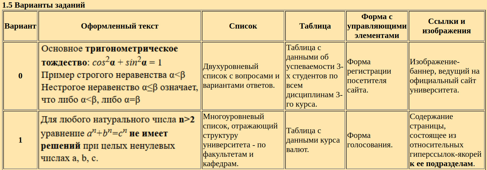

# Itech_lb1
Лабораторная работа №1 по дисциплине "Интернет технологии"

Как выглядит HTML-страничка можно посмотреть [здесь](https://user576g.github.io/Itech_Labs/Lb1/index.html) (GitHub Pages).

## Задание

Создать HTML-документ на произвольную тематику на основе произвольного макета страницы (2-х или 3-х колоночного, например). Документ должен содержать блочные и строковые элементы, заголовки. Использовать табличную верстку ‐ в целях лучшего освоения HTML, выполнять (пока!) без использования каскадных таблиц стилей.

Согласно варианту, добавить в документ:
1) оформленный текст;
2) список;
3) таблицу;
4) форму с управляющими элементами;
5) гипертекстовые ссылки и изображения

Ввариант №1

